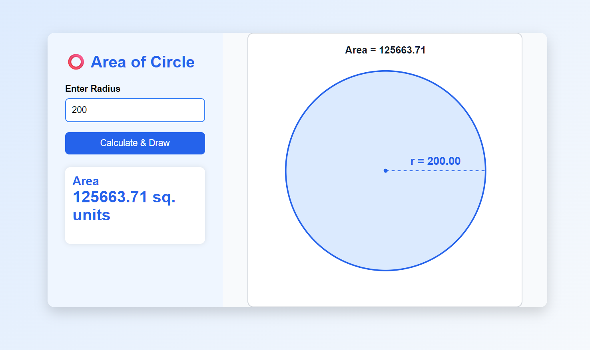

# Area of Circle Visualizer

A simple HTML, CSS, and JavaScript project that calculates the area of a circle and draws the circle using SVG.

## Preview

## Features

- Enter the radius
- Calculate the area
- Draw a proportional circle
- Display radius line
- Display radius label
- Responsive UI

## Formula

Area = π × r²

## Technologies

- HTML5
- CSS3
- JavaScript
- SVG

## Screenshot

(Add a screenshot here)

## How to Run

1. Download the project.
2. Open `index.html` in your browser.

No installation required.

## Author

Sarbeswar panda

MIT License

Copyright (c) 2026 Sarbeswar panda

Permission is hereby granted, free of charge, to any person obtaining a copy...